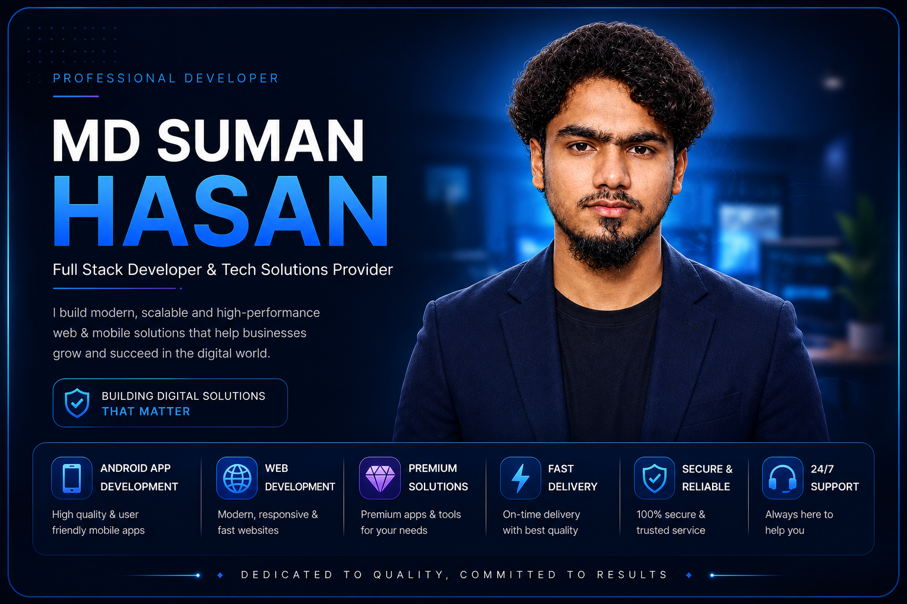

<!DOCTYPE html>
<html lang="bn">
<head>
    <meta charset="UTF-8">
    <meta name="viewport" content="width=device-width, initial-scale=1.0">
    <title>SBU SUMON HASAN Premium Apps & Tech Solution</title>
    
    
    
    <link href="https://vjs.zencdn.net/8.10.0/video-js.css" rel="stylesheet" />
    <link href="https://fonts.googleapis.com/css2?family=Hind+Siliguri:wght@400;600;700&family=Poppins:wght@400;600;700&display=swap" rel="stylesheet">

    
</head>
<body>
    
<header>
    <h1>SBU Premium App Store</h1>
    
সফটওয়্যার ডাউনলোড এবং যেকোনো টেক রিলেটেড সমস্যার ওয়ান-স্টপ সল্যুশন

</header>

    

    
    

        <h2 style="color: var(--primary-color); margin-bottom: 12px; font-size: 1.5rem;">আমাদের ওয়েবসাইটে আপনাকে স্বাগতম</h2>
        
আজকের ডিজিটাল যুগে আমাদের প্রতিদিনের নানা কাজের জন্য বিভিন্ন প্রিমিয়াম অ্যাপ এবং ফাইল প্রয়োজন হয়। কিন্তু ইন্টারনেটে থাকা সাধারণ মোড অ্যাপগুলো অনেক সময় ম্যালওয়্যার বা ভাইরাসে ভরা থাকে। আপনার এই দুশ্চিন্তা দূর করতেই আমার এই নিরাপদ উদ্যোগ!

        
        

            
        

    

    

        <h2 class="section-title" style="border: none; padding: 0; color: var(--accent-color); text-shadow: 0 0 15px rgba(255,71,87,0.2);">🔴 win-Sports লাইভ সম্প্রচার</h2>
        
        

            <strong>⚠️ বিশেষ নোটিশ:</strong> 
            এই লাইভ টিভি চ্যানেলটি <strong>শুধুমাত্র সরাসরি খেলা চলার সময়ই সচল (Active) করা হয়</strong>। খেলা না থাকলে সার্ভারটি সাময়িকভাবে বন্ধ থাকে। ম্যাচ শুরু হওয়ার পর পেজটি রিফ্রেশ করুন, খেলা অটোমেটিক চালু হয়ে যাবে। বড় স্ক্রিন বা টিভিতে দেখার জন্য প্লেয়ারের ডানদিকের স্কয়ার বাটনে ক্লিক করে ফুল-স্ক্রিন করুন।
        

        
        

            <video 
                id="live-tv-player" 
                class="video-js vjs-default-skin vjs-big-play-centered vjs-show-control-bar" 
                controls 
                preload="auto" 
                width="640"
                height="360"
                data-setup='{"fluid": true, "playbackRates": [1], "controlBar": {"pictureInPictureToggle": true, "fullscreenToggle": true}}'>
                <source src="http://198.195.239.50:8095/tsports/index.m3u8" type="application/x-mpegURL">
                

                    এই ভিডিওটি দেখার জন্য ব্রাউজারে জাভাস্ক্রিপ্ট সচল করা প্রয়োজন।
                

            </video>
        

        

            

                

                সংযুক্ত লোকাল সার্ভার / এফটিপি পোর্টাল (ইনডিপেনডেন্ট স্ক্রল বক্স)
            

            

                <iframe src="http://198.195.239.50/" allowfullscreen></iframe>
            

        

    

    

        <h2 class="section-title">📥 অফিশিয়াল অ্যান্ড্রয়েড অ্যাপ ডাউনলোড</h2>
        
আমাদের ওয়েবসাইটটি আরও সহজে ব্যবহার করতে এবং সরাসরি স্মার্ট টিভি বা ফোনে খেলা দেখতে নিচের বাটন থেকে আমাদের অফিশিয়াল অ্যাপটি ডাউনলোড করে ইনস্টল করে নিন।

        
        

            

                <h3>SBU Premium App Store (v1.0)</h3>
                
ফাইল টাইপ: অফিশিয়াল এপিকে | রিকোয়ারমেন্ট: Android 5.0 বা তার উপরে

            

            <a href="https://drive.google.com/file/d/11YLQzaMvfh3ZSLAlHuVmJm19RiPl25Aj/view?usp=drivesdk=" target="_blank" class="btn-download">
                ⬇️ ডাউনলোড এপিকে (APK)
            </a>
        

    

    

        
🛡️

        

            <h3 style="margin: 0; color: #34d399; font-size: 1.2rem; font-weight: 600;">১০০% অ্যান্টিভাইরাস দ্বারা পরীক্ষিত ও নিরাপদ</h3>
            
আমার এখানে উপলব্ধ প্রতিটি অ্যাপ বা জিপ ফাইল আপলোড করার আগে <strong>Kaspersky, Bitdefender</strong> এবং <strong>VirusTotal</strong>-এর মাধ্যমে স্ক্যান করা হয়। আমরা শতভাগ গ্যারান্টি দিচ্ছি যে এখানে কোনো ভাইরাস, ক্ষতিকারক কোড বা ট্রোজান নেই। আপনার ডিভাইসের নিরাপত্তা আমাদের সর্বোচ্চ অগ্রাধিকার।

        

    

    

        <h2 class="section-title">আমরা যেসব সেবা ও সমাধান দিয়ে থাকি</h2>
        

            

                <h3>💎 প্রিমিয়াম অ্যাপস ও গেমস</h3>
                
যেকোনো ট্রেন্ডিং এবং কাজের অ্যাপসের প্রো, অ্যাড-ফ্রি এবং প্রিমিয়াম মেম্বারশিপ ভার্সন খুব সাশ্রয়ী মূল্যে পেয়ে যাবেন আমাদের কাছে।

            

            

                <h3>🛠️ অ্যাপস ক্র্যাশ ও এরর ফিক্স</h3>
                
আপনার ফোনে কোনো দরকারি অ্যাপ ওপেন হচ্ছে না বা বারবার ক্র্যাশ করছে? আমাদের জানান, আমরা কোড লেভেলে এর সমাধান করে দেবো।

            

            

                <h3>📱 অ্যান্ড্রয়েড ও ওএস কাস্টমাইজেশন</h3>
                
ফোনের স্লো পারফরম্যান্স ফিক্স করা, কাস্টম লোগো তৈরি, অ্যাপের ইন্টারনাল সোর্স কোড মডিফিকেশনসহ যেকোনো টেকনিক্যাল সাপোর্ট।

            

            

                <h3>📡 ওয়াই-ফাই ও নেটওয়ার্ক সল্যুশন</h3>
                
আপনার লোকাল নেটওয়ার্ক, ওয়াই-ফাই রাউটার কনফিগারেশন বা যেকোনো কানেক্টিভিটি সমস্যার দ্রুত এবং কার্যকরী সমাধান।

            

        

    

    

        <h2 class="section-title">কেন আমাদের ওপর আস্থা রাখবেন?</h2>
        <ul style="padding-left: 20px; color: #cbd5e1; font-size: 0.95rem;">
            <li style="margin-bottom: 10px;"><strong>লাইফটাইম সাপোর্ট:</strong> আমাদের কাছ থেকে নেওয়া যেকোনো অ্যাপের পরবর্তী আপডেট বা সমস্যায় পাবেন আজীবন ফ্রি কাস্টমার সাপোর্ট।</li>
            <li style="margin-bottom: 10px;"><strong>ওয়ান-ক্লিক ইনস্টলেশন:</strong> কোনো জটিল সেটআপ ছাড়াই অ্যাপগুলো সরাসরি ফোনে ইনস্টল করতে পারবেন।</li>
            <li style="margin-bottom: 10px;"><strong>সরাসরি লাইভ চ্যাট:</strong> যেকোনো সমস্যার জন্য কোনো ফর্ম পূরণ করতে হবে না, সরাসরি আমাদের সাথে কথা বলুন।</li>
        </ul>
    

    

        <h2 class="section-title" style="border: none; padding: 0; text-align: center;">আমাদের সাথে যোগাযোগ করুন</h2>
        
যেকোনো অ্যাপ অর্ডার করতে বা আপনার ফোনের যেকোনো সমস্যার তাৎক্ষণিক সমাধান পেতে নিচে দেওয়া আমাদের অফিশিয়াল মাধ্যমে নক দিন। আমরা ২৪/৭ আপনাদের সেবায় নিয়োজিত।

        
        

            <a href="https://wa.me/8801960678584" target="_blank" class="btn btn-whatsapp" rel="noopener"> 💬 হোয়াটসঅ্যাপে মেসেজ </a>
            <a href="https://www.facebook.com/md.shumon.hasan.2023" target="_blank" class="btn btn-facebook" rel="noopener"> 🔷 অফিশিয়াল ফেসবুক </a>
            <a href="tel:+8801960678584" class="btn btn-call"> 📞 সরাসরি কল করুন </a>
            <a href="mailto:sumonhasan249@gmail.com?subject=Tech%20Support%20&amp;%20App%20Request" class="btn btn-mail"> ✉️ ইমেইল সাপোর্ট </a>
        

    

    
© 2026 SBU Sumon Hasan. All Rights Reserved.

    
Designed for ultimate security and professional tech management.

</body>
</html>